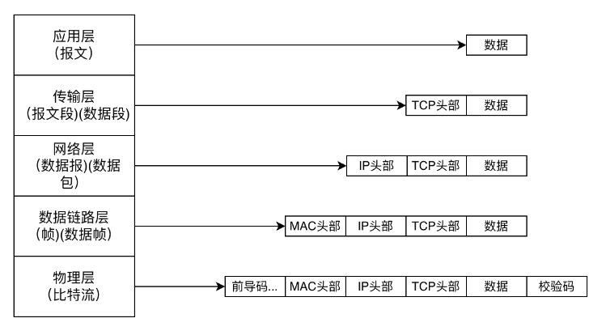
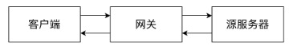

计算机网络
====

## 计算机网络体系结构

1. OSI七层模型
> OSI(Open System Interconnection Reference Model) 模型是国际标准化组织 ISO（International Organization for Standardization) 提出的一个试图使各种计算机在世界范围内互连为网络的标准框架。
OSI 将计算机网络体系结构划分为七层，每一层实现各自的功能和协议，并完成与相邻层的接口通信。OSI 的服务定义详细说明了各层所提供的服务。

> 应用层：通过应用程序间的交互来完成特定的网络应用。<br>
> 表示层：解释交换数据的含义。该层提供的服务主要包括数据压缩，数据加密以及数据描述。<br>
> 会话层：负责建立、管理和终止表示层实体之间的通信会话。该层提供了数据交换的定界和同步功能，包括了建立检查点和恢复方案的方法。<br>
> 传输层：负责因特网中两台主机的进程提供通信服务。<br>
> 网络层：选择合适的网间路由和交换节点，确保数据按时成功传送。<br>
> 数据链路层(链路层)：数据链路层将网络层交下来的 IP 数据报组装成帧，在两个相邻节点间的链路上传送帧。<br>
> 物理层：实现计算机节点之间比特流的透明传送，尽可能屏蔽掉具体传输介质和物理设备的差异。该层的主要任务是确定与传输媒体的接口的一些特性（机械特性、电气特性、功能特性，过程特性）<br>


2. TCP/IP 五层参考模型

> 五层体系的协议结构是综合了 OSI 和 TCP/IP 优点的一种协议，包括应用层、传输层、网络层、数据链路层和物理层。
> 其中应用层对应 OSI 的上三层，下四层和 OSI 相同。五层协议的体系结构只是为介绍网络原理而设计的，实际应用还是 TCP/IP 四层体系结构。

> 应用层 ：为特定应用程序提供数据传输服务。<br>
> 传输层 ：为进程提供通用数据传输服务。<br>
> 网络层 ：为主机提供数据传输服务。而传输层协议是为主机中的进程提供数据传输服务。<br>
> 数据链路层 ：网络层针对的还是主机之间的数据传输服务，而主机之间可以有很多链路，链路层协议就是为同一链路的主机提供数据传输服务。<br>
> 物理层 ：负责比特流在传输介质上的传播。<br>


3. 对比两种网络模型


4. 数据如何在各个层直接传输


假设一个主机上的一个应用向另一个主机的一个应用发送数据。

1. 在发送主机端，一个应用层报文被传送到传输层。在最简单的情况下，传输层收取到报文并附上附加信息，该首部将被接收端的传输层使用。<br>
2. 应用层报文和传输层首部信息一道构成了传输层报文段。附加的信息可能包括：允许接收端传输层向上向适当的应用程序交付报文的信息以及差错检测位信息。该信息让接收端能够判断报文中的比特是否在途中已被改变。<br>
3. 传输层则向网络层传递该报文段，网络层增加了如源和目的端系统地址等网络层首部信息，生成了网络层数据报文。<br>
4. 该数据报文接下来被传递给链路层，在数据链路层数据包添加发送端 MAC 地址和接收端 MAC 地址后被封装成数据帧。<br>
5. 在物理层数据帧被封装成比特流，之后通过传输介质传送到对端。而在接收主机端，整个过程正好反过来。<br>


## 应用层

1. 万维网和域名系统
```
万维网 (WWW，World Wide Web)，通常称为 Web，是一种信息系统，使文档和其他 Web资源能够通过 Internet 访问。
```
### 网络资源

网络上的资源必须有一个唯一的表示，才可以在网络上被访问。

uri(uniform resource identifier) 统一资源标识符。
url(uniform resource location) 统一资源定位符，统指绝对路径。
urn(uniform resource name) 统一资源名。
三者之间关系为， url 和 urn 分别是 URI 的子集 。
其中 URN 还处于实验阶段，未大范围进行使用，目前使用最多的是 url。

url 由三部分组成。
1. 方案，一般是访问资源使用的协议类型，比如http://、https://。
2. 服务器的 web 地址，可以为域名或者 ip 地址 + 端口号，比如 localhost:8080 或者 127.0.0.1:8080。不添加默认为 80 ，这是访问域名不用加端口号的原因 。
3. web 服务器上的某个资源，比如leetbook/read/networks-interview-highlights。
```text
http://leetcode.cn/leetbook/read/networks-interview-highlights
```
注意： url是否以/结尾，意义是不同的，用户无感知的原因是 因为服务器自动处理了这种差异。

### 应用程序体系架构

应用程序体系体系架构主要分为两种。

* C/S(client/server) ：客户端之间不进行通信，客户端向服务端发送请求获取数据，服务器要一直开机，需要配备大量的数据中心。比如：微信，google，bing等等。<br>
<br>
* P2P(peer to peer) ：对等通信，不需要数据中心，没有客户端和服务端的区别，应用程序在间断连接的主机对之间直接通信。主要应用在流量密集型应用。比如：迅雷，bitTorrent，或者在局域网的文件内部共享应用中。<br>
<br>
* 目前大型互联网应用主要采用的是 C/S 架构，导致 P2P 架构逐渐被人遗忘。 C/S 架构又可以细分为 C/S(client/server) 和 B/S(browser/server)，即根据客户端类型划分。<br>

本地客户端：速度快，安全，灵活性较高，但是开发成本就高，比如游戏客户端。
浏览器：不需要安装，依托于浏览器，安全性较低，成本极低。
目前很多应用既可以通过本地客户端访问也可以通过浏览器使用。比如，微信，outlook等等。


### web的结构组件

web 是极为复杂的，不仅只有 client 与 server 之间简单的请求响应 ，还包含了一些特殊的 server ，他们承担着一些特殊的作用。

* 代理：位于客户端和服务器之间的 http中间实体。<br>
<br>
出于安全考虑，通常会将代理做为转发所有 Web 流量的可信任中间节点使用，可以对请求和响应进行过滤。比如，校园网中可以过滤一些不健康的内容，禁止学生进行访问。


* 网关：连接其他应用程序的特殊 web 服务器。<br>
<br>
做为其他服务器的中间实体使用。常用于将 http 流量转化为其他的协议。网关接受请求时就好像自己本身是资源源服务器一样，客户端对此无感知。




隧道： 对 http通信报文进行盲转发的特殊代理。<br>
<br>
对两条连接之间的数据进行盲转发，https就是通过隧道实现的。http连接承载加密的安全套接字层`(ssl,secure sockets layer)流量，这样 ssl 流量就可以直接穿过只允许 web 流量通过防火墙，反正亦然。


### dns域名系统
（1）


### 网页解析全过程


2. http
3. 网络变成socket
4. 其他
> 内容分发网CDN

> 抓包软件原理

> 常用协议及其端口

## 传输层

1. 传输层服务
2. udp协议
3. tcp协议
4. quic协议
5. 不同协议之间的区别

## 网络层

1. IP协议
2. arp协议
3. icmp协议

## 数据链路层

1. 基本问题
2. mac地址

## 物理层

1. 通信方式
2. 信道复用技术
3. 宽带接入技术

## 计算机网络中的安全

1. DDos攻击
2. ARP攻击
3. AES 和 RSA

